# DeepLearning4Java
Design and implementation of a small DeepLearning library from scratch in Java, inspired by Keras and the book "Deep Learning From Scratch" by O'Reilly. The goal is to apply the main OOP Design Patterns and UML diagramming in a software project.
## Introduction

As a project for the Software Design and Databases courses at university, I created and executed a project for a game inspired by [QuickDraw](https://quickdraw.withgoogle.com/), where a neural network attempts to classify your hand-drawn sketches. 

Because of this, I decided to create a DeepLearning "library" from scratch in Java and use it in the game. By employing the main design patterns and best practices, I was inspired by the  [Keras](https://keras.io/) library and its Sequential API to create different architectures with the classic layers and operations of a neural network.

In the scope of databases, I used [MongoDB](https://www.mongodb.com/pt-br/lp/cloud/atlas/try4?utm_source=bing&utm_campaign=search_bs_pl_evergreen_atlas_core_prosp-brand_gic-null_amers-br_ps-all_desktop_eng_lead&utm_term=mongodb%20com&utm_medium=cpc_paid_search&utm_ad=e&utm_ad_campaign_id=415204511&adgroup=1209463260064162&msclkid=af01409a30a0127f01b62603654a6877?utm_source=bing&utm_campaign=search_bs_pl_evergreen_atlas_core_prosp-brand_gic-null_amers-br_ps-all_desktop_eng_lead&utm_term=mongodb%20com&utm_medium=cpc_paid_search&utm_ad=e&utm_ad_campaign_id=415204511&adgroup=1209463260064162&msclkid=af01409a30a0127f01b62603654a6877) and [Morphia](https://github.com/MorphiaOrg/morphia) for Object Document Mapping (ODM) and to persist the trained models.

---
## Rede Neural

The "library" uses the [ND4J](https://deeplearning4j.konduit.ai/nd4j/tutorials/quickstart) library for tensor and matrix manipulation, utilizing NDArray as the main data structure. Similar to Numpy, the library allows for vectorized and efficient operations, enabling its use in somewhat more complex applications. There are certain redundancies in using this library, as it already possesses many of the operations and serves as the foundation for the algebraic operations of [DL4J](https://github.com/deeplearning4j/deeplearning4j). The idea was to implement the relevant mathematical parts while taking advantage of the data structure it provides.

### Examples

The examples package contains some use cases and tests for the library. The main ones are:
- [Classification](src/main/java/br/deeplearning4java/neuralnetwork/examples/classification):
  - [Mnist](src/main/java/br/deeplearning4java/neuralnetwork/examples/classification/image/mnist/MnistNN.java): A simple example of a neural network for classifying handwritten digits from the MNIST dataset.
      
  - [QuickDraw](src/main/java/br/deeplearning4java/neuralnetwork/examples/classification/image/qdraw/QuickDrawNN.java): A neural network for classifying hand-drawn sketches from the QuickDraw dataset.

    
  https://github.com/user-attachments/assets/89a9018f-7fde-499f-98fc-78a282b8ec2f
  
  https://github.com/user-attachments/assets/51b63c3d-6666-4556-9917-fa72c03d1148
  
- [Regression](src/main/java/br/deeplearning4java/neuralnetwork/examples/regression):
  - [Linear](src/main/java/br/deeplearning4java/neuralnetwork/examples/regression/LinearRegression.java): A simple example of a neural network for linear regression.
  - [NonLinearFunctions](src/main/java/br/deeplearning4java/neuralnetwork/examples/regression/NonLinearFunctions.java): A neural network for approximating non-linear functions, such as sine, saddle, rosenbrock, and others.

    <table>
        <tr>
            <td>
                <figure>
                    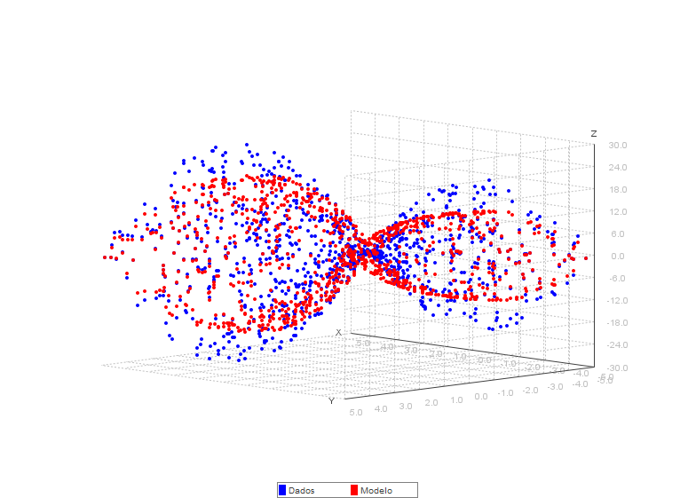
                    <figcaption>Saddle Function</figcaption>
                </figure>
            </td>
            <td>
                <figure>
                    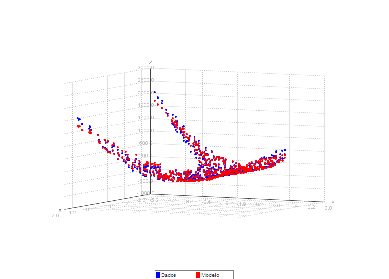
                    <figcaption>Rosenbrock Function</figcaption>
                </figure>
            </td>
        </tr>
        <tr>
            <td>
                <figure>
                    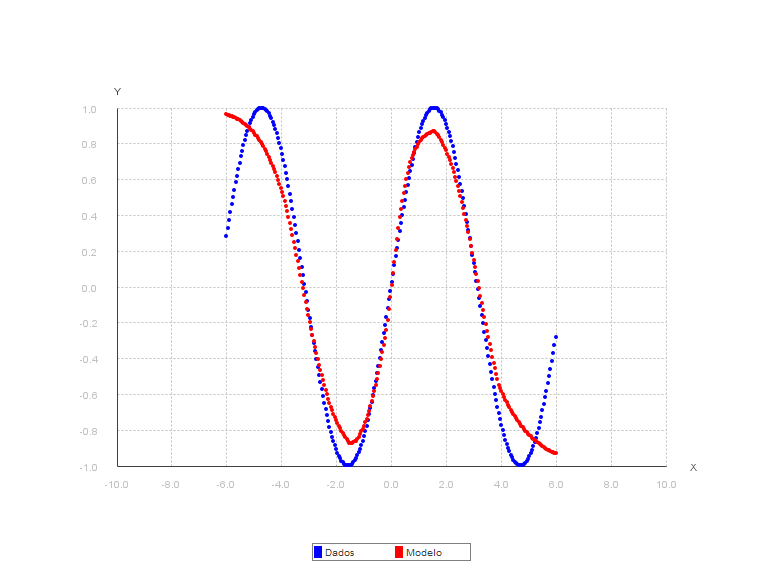
                    <figcaption>Sine Function</figcaption>
                </figure>
            </td>
            <td>
                <figure>
                    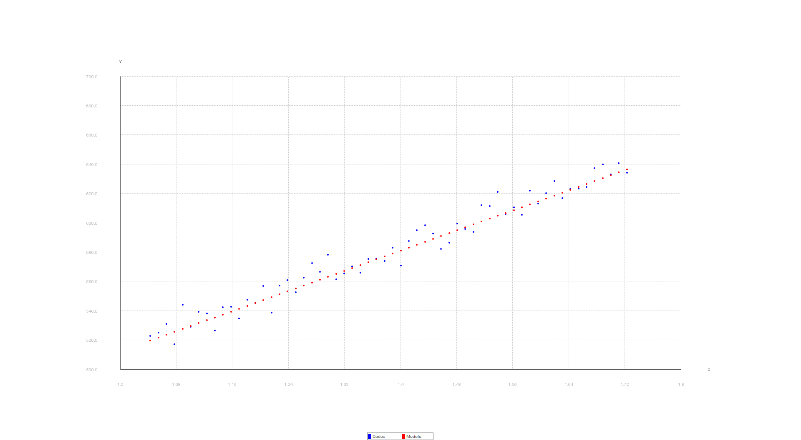
                    <figcaption>Linear Regression</figcaption>
                </figure>
            </td>
        </tr>
    </table>
    
- Code example for training a neural network with the library:
    ```java
    DataLoader dataLoader = new DataLoader(root + "/npy/train/x_train250.npy", root + "/npy/train/y_train250.npy", root + "/npy/test/x_test250.npy", root + "/npy/test/y_test250.npy");
    INDArray xTrain = dataLoader.getAllTrainImages().get(NDArrayIndex.interval(0, trainSize));
    INDArray yTrain = dataLoader.getAllTrainLabels().reshape(-1, 1).get(NDArrayIndex.interval(0, trainSize));
    INDArray xTest = dataLoader.getAllTestImages().get(NDArrayIndex.interval(0, testSize));
    INDArray yTest = dataLoader.getAllTestLabels().reshape(-1, 1).get(NDArrayIndex.interval(0, testSize));

    // Normalization
    xTrain = xTrain.divi(255);
    xTest = xTest.divi(255);
    // Reshape
    xTrain = xTrain.reshape(xTrain.rows(), 28, 28, 1);
    xTest = xTest.reshape(xTest.rows(), 28, 28, 1);
  
    NeuralNetwork model = new ModelBuilder()
        .add(new Conv2D(32, 2, Arrays.asList(2, 2), "valid", Activation.create("relu"), "he"))
        .add(new Conv2D(16, 1, Arrays.asList(1, 1), "valid", Activation.create("relu"), "he"))
        .add(new Flatten())
        .add(new Dense(178, Activation.create("relu"), "he"))
        .add(new Dropout(0.4))
        .add(new Dense(49, Activation.create("relu"), "he"))
        .add(new Dropout(0.3))
        .add(new Dense(numClasses,  Activation.create("linear"), "he"))
        .build();
  
    int epochs = 20;
    int batchSize = 64;

    LearningRateDecayStrategy lr = new ExponentialDecayStrategy(0.01, 0.0001, epochs);
    Optimizer optimizer = new RMSProp(lr);
    Trainer trainer = new TrainerBuilder(model, xTrain, yTrain, xTest, yTest, new SoftmaxCrossEntropy())
            .setOptimizer(optimizer)
            .setBatchSize(batchSize)
            .setEpochs(epochs)
            .setEvalEvery(2)
            .setEarlyStopping(true)
            .setPatience(4)
            .setMetric(new Accuracy())
            .build();
    trainer.fit();
    ```
    Complete example: [QuickDrawNN.java](src/main/java/br/deeplearning4java/neuralnetwork/examples/classification/image/qdraw/QuickDrawNN.java)

### Features

The library has the following features and is structured into the following packages:
```markdown
src/main/java/br/deeplearning4java/neuralnetwork
├── core
│   ├── activation
│   ├── layers
│   ├── losses
│   ├── metrics
│   ├── optimizers
│   ├── models
│   └── train
└── data
│   └── preprocessing
└── database
└── examples
│   ├── activations
│   ├── classification
│   ├── regression
    └── persist
```

- Layers: [Dense](src/main/java/br/deeplearning4java/neuralnetwork/core/layers/Dense.java), [Dropout](src/main/java/br/deeplearning4java/neuralnetwork/core/layers/Dropout.java), [Flatten](src/main/java/br/deeplearning4java/neuralnetwork/core/layers/Flatten.java), [Conv2D](src/main/java/br/deeplearning4java/neuralnetwork/core/layers/Conv2D.java), [MaxPooling2D](src/main/java/br/deeplearning4java/neuralnetwork/core/layers/MaxPooling2D.java), [ZeroPadding2D](src/main/java/br/deeplearning4java/neuralnetwork/core/layers/ZeroPadding2D.java)
    - UML:
        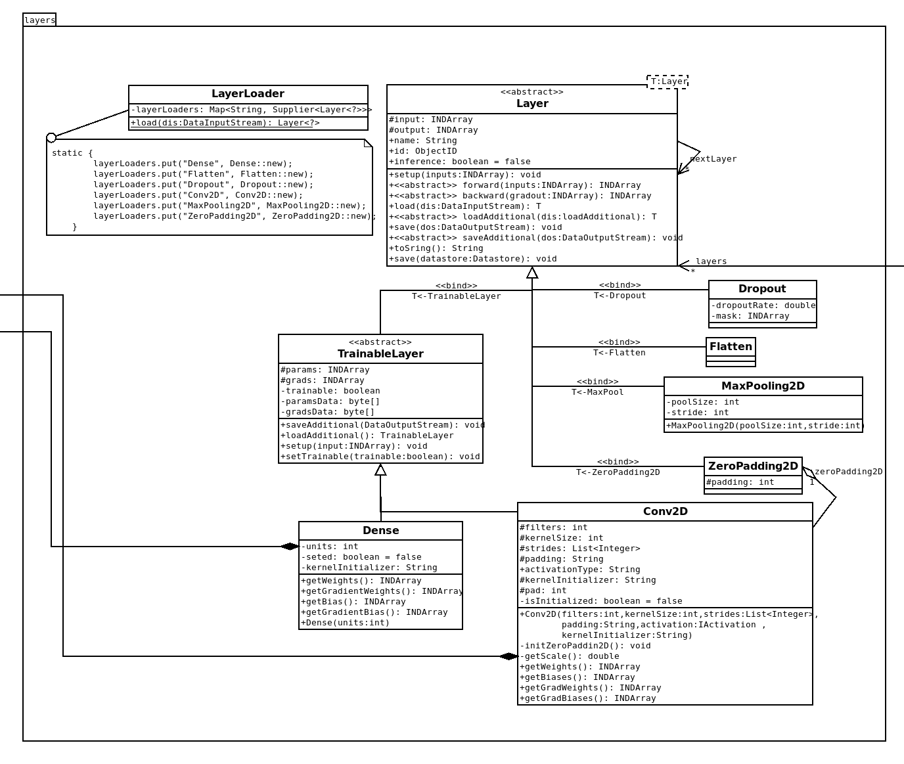

- Activation functions: [ReLU](src/main/java/br/deeplearning4java/neuralnetwork/core/activation/ReLU.java), [LeakyReLU](src/main/java/br/deeplearning4java/neuralnetwork/core/activation/LeakyReLU.java), [SiLU](src/main/java/br/deeplearning4java/neuralnetwork/core/activation/SiLU.java), [Sigmoid](src/main/java/br/deeplearning4java/neuralnetwork/core/activation/Sigmoid.java), [Tanh](src/main/java/br/deeplearning4java/neuralnetwork/core/activation/TanH.java), [Softmax](src/main/java/br/deeplearning4java/neuralnetwork/core/activation/Softmax.java)
    - [Ilustração](src/main/java/br/deeplearning4java/neuralnetwork/examples/activations/PlotGraphs.java):
        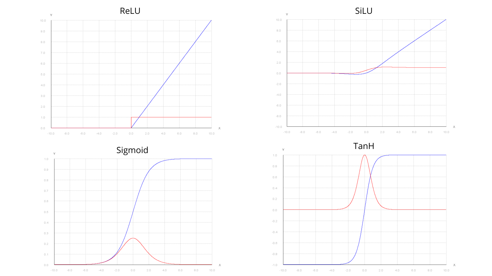
  
    - UML:
        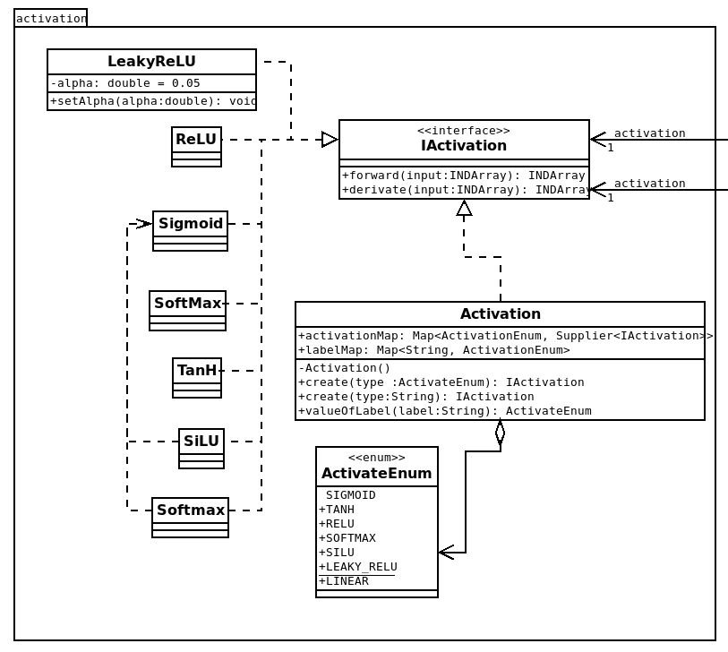

- Loss Functions: [MSE](src/main/java/br/deeplearning4java/neuralnetwork/core/losses/MeanSquaredError.java), [BinaryCrossEntropy](src/main/java/br/deeplearning4java/neuralnetwork/core/losses/BinaryCrossEntropy.java), [CategoricalCrossEntropy](src/main/java/br/deeplearning4java/neuralnetwork/core/losses/CategoricalCrossEntropy.java), [SoftmaxCrossEntropy](src/main/java/br/deeplearning4java/neuralnetwork/core/losses/SoftmaxCrossEntropy.java)

    - UML:
        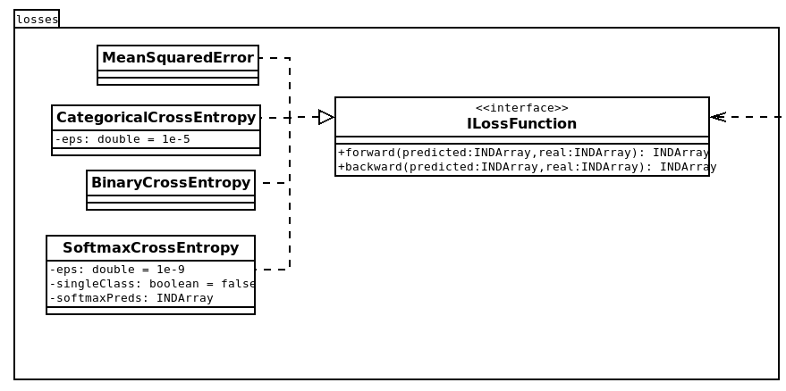

- Optimizers: [SGD](src/main/java/br/deeplearning4java/neuralnetwork/core/optimizers/SGD.java), [Adam](src/main/java/br/deeplearning4java/neuralnetwork/core/optimizers/Adam.java), [RMSProp](src/main/java/br/deeplearning4java/neuralnetwork/core/optimizers/RMSProp.java), [AdaGrad](src/main/java/br/deeplearning4java/neuralnetwork/core/optimizers/AdaGrad.java), [AdaDelta](src/main/java/br/deeplearning4java/neuralnetwork/core/optimizers/AdaDelta.java), [SGDMomentum](src/main/java/br/deeplearning4java/neuralnetwork/core/optimizers/SGDMomentum.java), [SGDNesterov](src/main/java/br/deeplearning4java/neuralnetwork/core/optimizers/SGDNesterov.java), [RegularizedSGD](src/main/java/br/deeplearning4java/neuralnetwork/core/optimizers/RegularizedSGD.java)
    - Learning Rate Decay: [ExponentialDecay](src/main/java/br/deeplearning4java/neuralnetwork/core/optimizers/ExponentialDecayStrategy.java), [LinearDecay](src/main/java/br/deeplearning4java/neuralnetwork/core/optimizers/LinearDecayStrategy.java)
      
    - UML:
        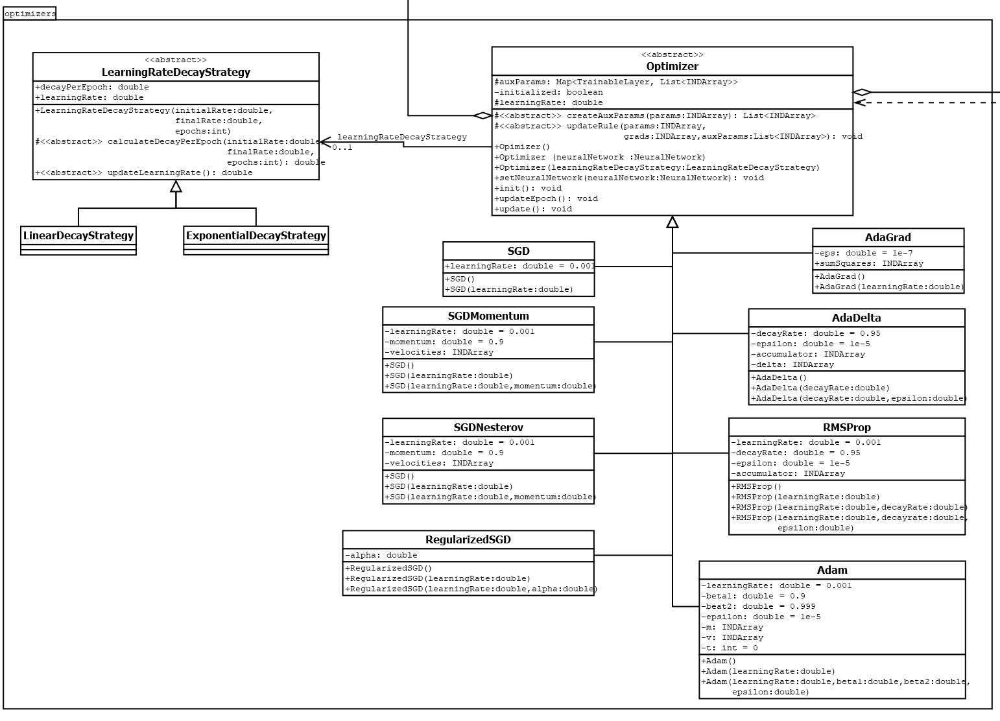

- Models: [ModelBuilder](src/main/java/br/deeplearning4java/neuralnetwork/core/models/ModelBuilder.java), [NeuralNetwork](src/main/java/br/deeplearning4java/neuralnetwork/core/models/NeuralNetwork.java)
    - UML:
        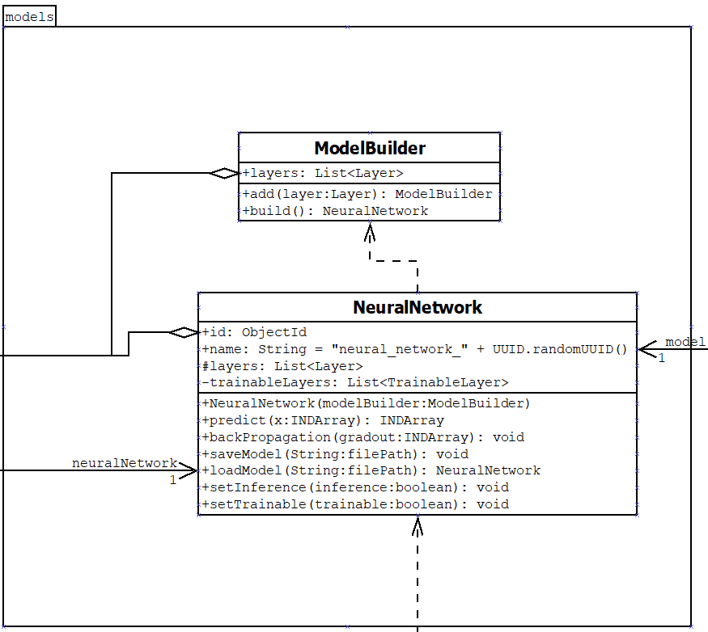

- Train: [Trainer](src/main/java/br/deeplearning4java/neuralnetwork/core/train/Trainer.java), [TrainerBuilder](src/main/java/br/deeplearning4java/neuralnetwork/core/train/TrainerBuilder.java)
    - UML:
        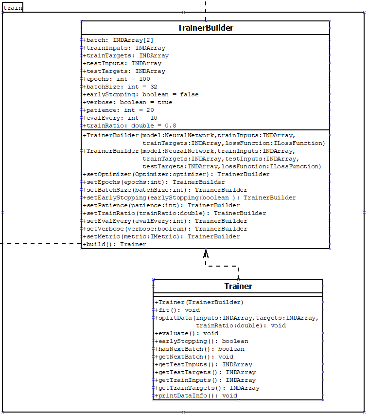

- Metrics: [Accuracy](src/main/java/br/deeplearning4java/neuralnetwork/core/metrics/Accuracy.java), [Precision](src/main/java/br/deeplearning4java/neuralnetwork/core/metrics/Precision.java), [Recall](src/main/java/br/deeplearning4java/neuralnetwork/core/metrics/Recall.java), [F1Score](src/main/java/br/deeplearning4java/neuralnetwork/core/metrics/F1Score.java), [MSE](src/main/java/br/deeplearning4java/neuralnetwork/core/metrics/MSE.java), [MAE](src/main/java/br/deeplearning4java/neuralnetwork/core/metrics/MAE.java), [RMSE](src/main/java/br/deeplearning4java/neuralnetwork/core/metrics/RMSE.java), [R2](src/main/java/br/deeplearning4java/neuralnetwork/core/metrics/R2.java)
    - UML:
        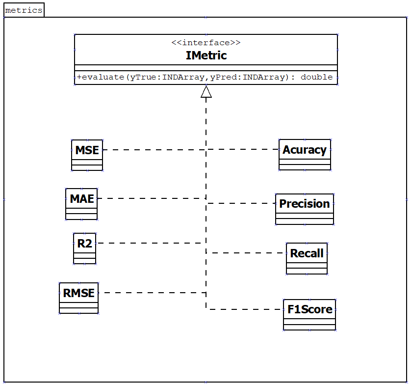

- Data: [DataProcessor](src/main/java/br/deeplearning4java/neuralnetwork/data/processing/DataProcessor.java), [DataPipeline](src/main/java/br/deeplearning4java/neuralnetwork/data/processing/DataPipeline.java), [StandardScaler](src/main/java/br/deeplearning4java/neuralnetwork/data/processing/StandardScaler.java), [MinMaxScaler](src/main/java/br/deeplearning4java/neuralnetwork/data/processing/MinMaxScaler.java), [Util](src/main/java/br/deeplearning4java/neuralnetwork/data/Util.java), [DataLoader](src/main/java/br/deeplearning4java/neuralnetwork/data/DataLoader.java), [PlotDataPredict](src/main/java/br/deeplearning4java/neuralnetwork/data/PlotDataPredict.java)
    - UML:
        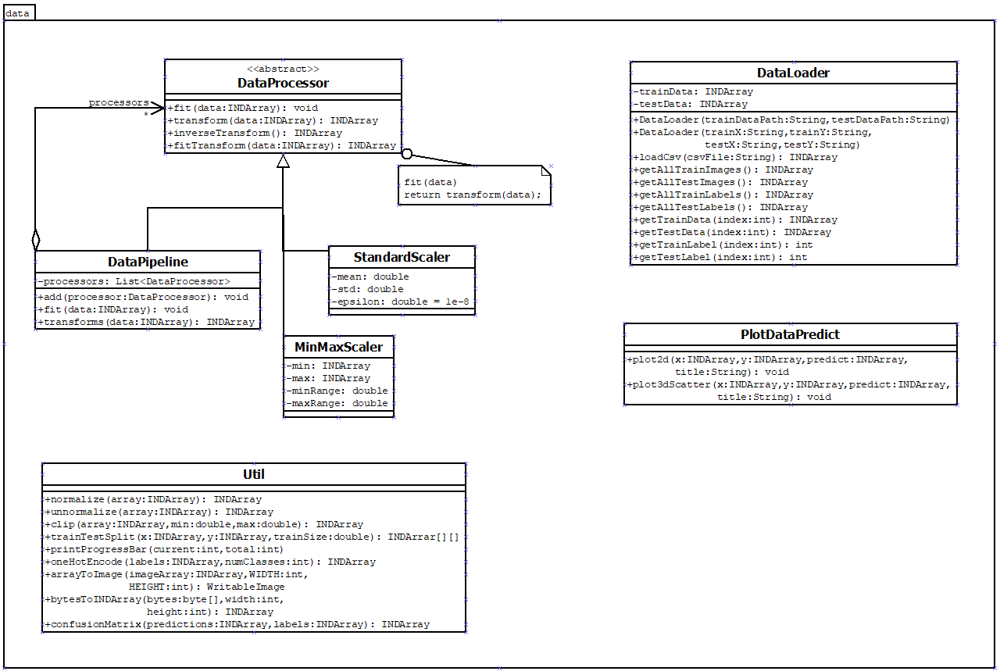
- Datastore: [NeuralNetworkService](src/main/java/br/deeplearning4java/neuralnetwork/database/NeuralNetworkService.java), [NeuralNetworkRepository](src/main/java/br/deeplearning4java/neuralnetwork/database/NeuralNetworkRepository.java), [NeuralNetworkEntity](src/main/java/br/deeplearning4java/neuralnetwork/database/NeuralNetworkEntity.java)
    - UML:
        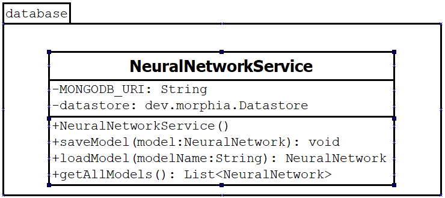

Full diagram: [UML Diagram](src/main/resources/diagram/Diagram.png), [UML Diagram (Dia)](src/main/resources/diagram/Diagram.dia)

--- 
## Game

The game essentially uses the model trained with the "library" in [QuickDrawNN](src/main/java/br/deeplearning4java/neuralnetwork/examples/classification/image/qdraw/QuickDrawNN.java) to classify the drawings made by the player. Ten classes from the original dataset were selected, and each session consists of 4 rounds. In each round, if the prediction confidence is greater than 50%, the drawing and the round are saved in the database. There is also a visualization screen that allows users to view all the drawings saved in the database and delete them.

The game implementation uses JavaFX with the MVC pattern.

https://github.com/user-attachments/assets/2684f4ec-6d96-46ff-acc2-6fa272d6ab3f
